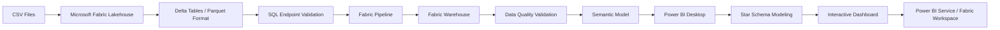

# Swiggy Data Analysis Architecture

```mermaid
flowchart LR

A[CSV Files] --> B[Microsoft Fabric Lakehouse]

B --> C[Delta Tables / Parquet Format]

C --> D[SQL Endpoint Validation]

D --> E[Fabric Pipeline]

E --> F[Fabric Warehouse]

F --> G[Data Quality Validation]

G --> H[Semantic Model]

H --> I[Power BI Desktop]

I --> J[Star Schema Modeling]

J --> K[Interactive Dashboard]

K --> L[Power BI Service / Fabric Workspace]
```
